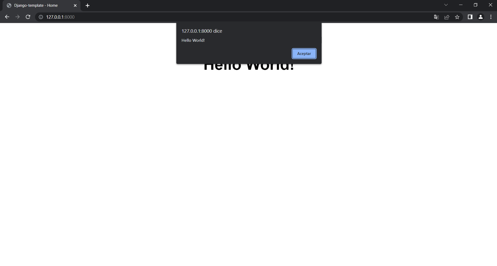

# Django Template
By using this pre-made project as a template, developers can save time and effort that would otherwise be spent on building the basic structure of a Django project from scratch. The project may include pre-configured settings, templates, and other resources that can be used to speed up development and simplify the process of building a new web application.

However, it's important to note that the pre-made project may not be suitable for all use cases, and developers should carefully review the code to ensure that it meets their specific needs. Additionally, developers may need to modify or customize the code in order to fully realize their application requirements.

Overall, this pre-made Django project template can be a useful resource for developers looking to get started with Django or looking to speed up the development process of their web application.

## Configuration
Rename the parent directory to the name of your project.

Make sure you have python installed, I use version 3.11.

The only configuration you need to do is to create an .env file in the main directory with your configuration.

Example:
```
# True for development, False for production
DEBUG=True

# Deployment SERVER address
SERVER=192.168.0.6

# Used for CDN (in production)
# No Slash at the end
ASSETS_ROOT=/static/assets

# POSTGRESQL Configuration
SQL_ENGINE=django.db.backends.postgresql_psycopg2
SQL_DATABASE=usersDB
SQL_USER=gcmps
SQL_PASSWORD=Thisisyourpassword
SQL_HOST=127.0.0.1
SQL_PORT=5432
```

Run first_time.sh, this will set up a virtual environment for your project and install all the necessary tools for the project.

Then runserver.sh, this will run the django server and you're good to go! You have a pre-built Django project!

## Preview
